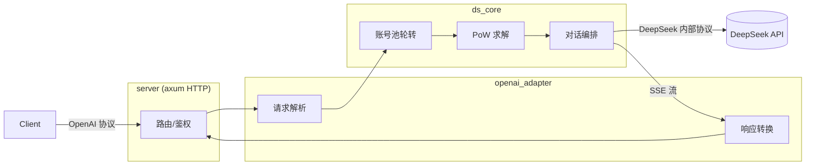

# DS-Free-API

[](LICENSE)


[English](README.en.md)

将免费的deepseek网页端对话反代并适配转换为标准的api协议 (目前只有 openai_chat_completions 支持, 后续会增加)

支持rust原生多端高性能, 单可执行文件+单toml配置文件

## 快速开始

去 [release](https://github.com/NIyueeE/deepseek-web-api/releases) 下载对应平台后解压即可

```
  .
  ├── ds-free-api          # 可执行文件
  ├── LICENSE
  ├── README.md
  ├── README.en.md
  └── config.example.toml  # 配置示例
```

### 配置

复制 config.example.toml 为 config.toml 和可执行文件保持在同一个路径下, 或者使用 `./ds-free-api -c <config_path>` 指定配置路径

### 运行

```bash
# 直接运行 (同目录下需要 config.toml)
./ds-free-api

# 指定配置路径
./ds-free-api -c /path/to/config.toml

# 调试模式
RUST_LOG=debug ./ds-free-api
```

这里只展示必填项, 一个账号一个并发量 (但好像是最多二个并发)

```toml
[server]
host = "127.0.0.1"
port = 5317

# API 访问令牌，留空则不鉴权
# [[server.api_tokens]]
# token = "sk-your-token"
# description = "开发测试"

# 二选一或者都填, 手机号码好像只支持+86地区, 所以好像可以通过魔法在海外地区使用邮箱无限注册账号
[[accounts]]
email = "user1@example.com"
mobile = ""
area_code = ""
password = "pass1"
```

这里分享一个免费的测试用账号, 不要发敏感信息 (虽然程序每次会收尾删除会话, 但是可能会遗留)

```text
rivigol378@tatefarm.com
test12345
```

想要自己多整几个账号并发的话, 可以研究一下临时邮箱(有些可能不行), 然后加魔法在国际版中多注册几个账号

这里推荐一个临时邮箱网站[temp-mail.org](https://temp-mail.org/en/10minutemail)

## API 端点

| 方法 | 路径 | 说明 |
|------|------|------|
| GET | `/` | 健康检查 |
| POST | `/v1/chat/completions` | 聊天补全 |
| GET | `/v1/models` | 模型列表 |
| GET | `/v1/models/{id}` | 模型详情 |

## 模型映射

`config.toml` 中 `model_types` (默认 `["default", "expert"]`) 自动映射：

| OpenAI 模型 ID | DeepSeek 类型 |
|----------------|--------------|
| `deepseek-default` | 快速模式 |
| `deepseek-expert` | 专家模式 |

开启`深度思考`：请求体中加 `"reasoning_effort": "high"`, 这里可以看 [Create chat completion | OpenAI API Reference](https://developers.openai.com/api/reference/resources/chat/subresources/completions/methods/create) , 反正非 `"none"` 即可

开启`智能搜索`：请求体中加 `"web_search_options": {"search_context_size": "high"}` (感觉没必要, 好像就算开了之后也很难触发, 模型会忘记自己能够使用内部搜索, 原因不明)

## 开发

需要 Rust 1.94.1+ (见 `rust-toolchain.toml`)。

```bash
# 检查 (check + clippy + fmt)
just check

# 运行测试
cargo test

# 运行 HTTP 服务
just serve

# CLI 示例
just ds-core-cli
just openai-adapter-cli
```

简要架构图:



数据管道:

- **请求**: `JSON body` → `normalize` 校验/默认值 → `tools` 提取 → `prompt` ChatML 构建 → `resolver` 模型映射 → `ChatRequest`
- **响应**: `DeepSeek SSE bytes` → `sse_parser` → `state` 补丁状态机 → `converter` 格式转换 → `tool_parser` XML 解析 → `StopStream` 截断 → `OpenAI SSE bytes`

## 许可证

[Apache License 2.0](LICENSE)

DeepSeek 官方 API 非常便宜，请大家多多支持官方服务。

本项目的初心是想体验官方网页端灰度测试的最新模型。

**严禁商用**，避免对官方服务器造成压力，否则风险自担。
